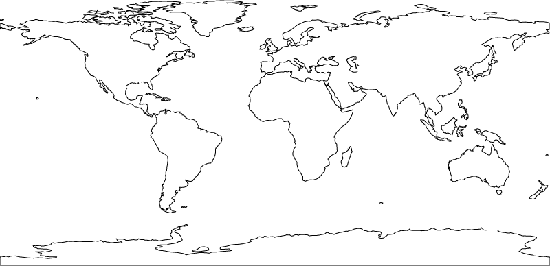
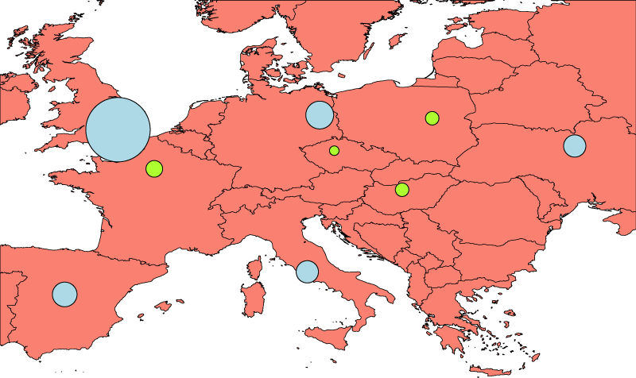
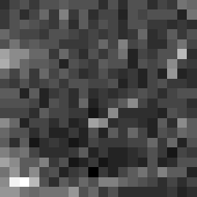
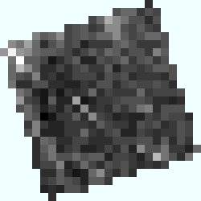
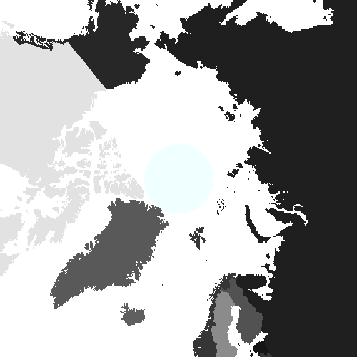

## **Map Rendering Overview**
With Aspose.GIS for .NET you can render a map from a Shapefile, FileGDB, GeoJSON, KML or other [supported file formats](/gis/net/supported-file-formats-html/) to SVG, PNG, JPEG, or BMP.

Here’s how to render a map from a shapefile to SVG using default settings:



Here’s the result:

Let’s take a closer look at the code.

First, we instantiate a [Map ](https://apireference.aspose.com/net/gis/aspose.gis.rendering/map)object. It represents a collection of layers from various sources that can be rendered. A Map has a size it’s intended to be displayed at. Here we set the map to be 800 pixels wide and 400 pixels tall.

Notice that the Map is enclosed into the using statement. This is necessary because the map keeps track of all resources added to it, and disposes them when we’re done with rendering and Map object is disposed.

Next, we add a layer from a file to the map. Each layer is rendered on top of the previous layer, in the order in which they were added to the map. See more details about how to open vector layers [here](/gis/net/working-with-vector-layers-html/).

Finally, we call [Map.Render](https://apireference.aspose.com/net/gis/aspose.gis.rendering.map/render/methods/1) to render the map into a file. We specify a path to where to save the result file and a renderer to use. Class [Renderers ](https://apireference.aspose.com/net/gis/aspose.gis.rendering/renderers)contains references to all renderers included with Aspose.GIS. For example, you can specify Renderers.Png instead of Renderers.Svg in the example above to render the map into a PNG file
## **Advanced Styling**
With Aspose.GIS API, you can customize rendering and feature styles in order to achieve the look you want. 


## **Draw raster in map**
With Aspose.GIS for .NET you can render a map from raster formats.
### **Render with default settings**
Here’s how to render a map from a GeoTIFF to SVG using default settings:



### **Render skew rasters**
With Aspose.GIS you can render a raster with skew raster cells.



### **Render in polar spatial reference**
Aspose.GIS lets you using polar spatial references on a map rendering process.



