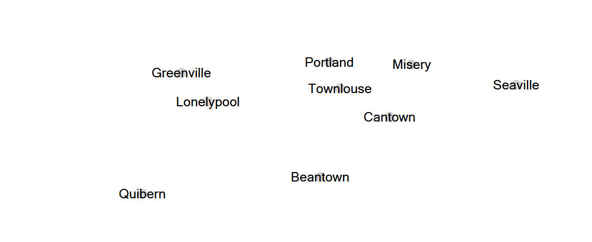
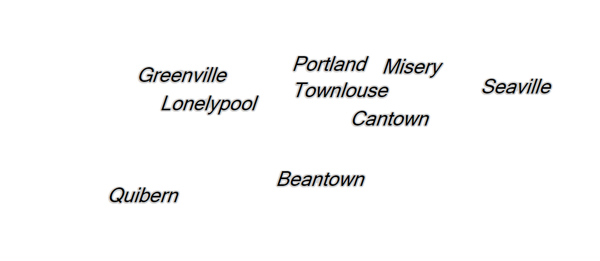
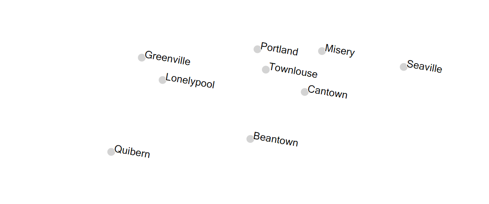
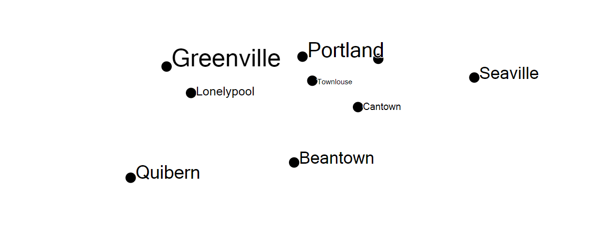
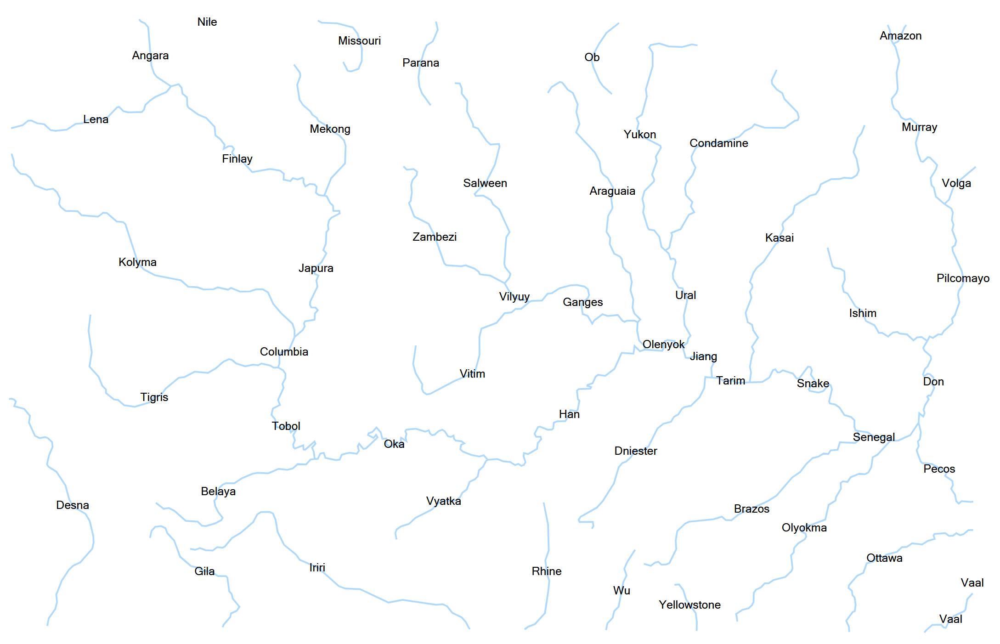
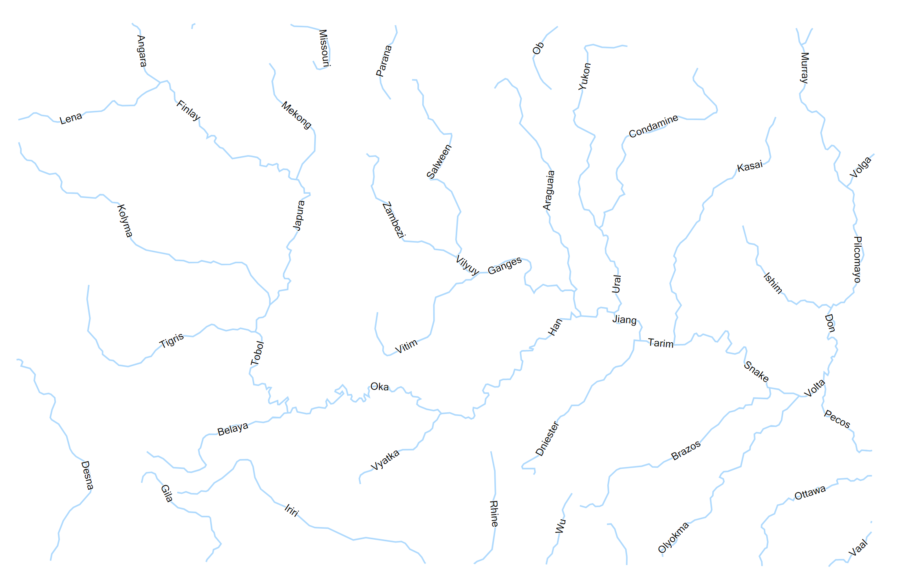
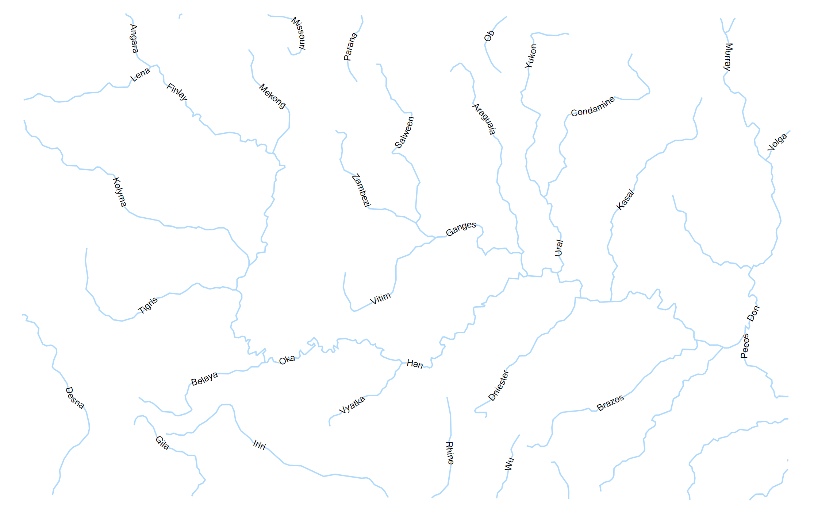
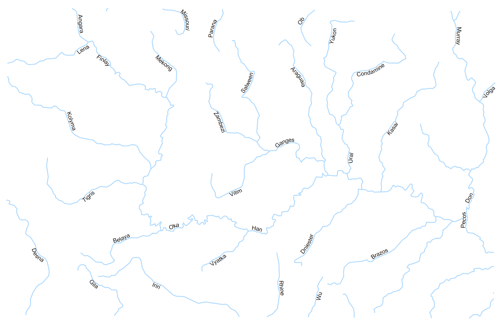
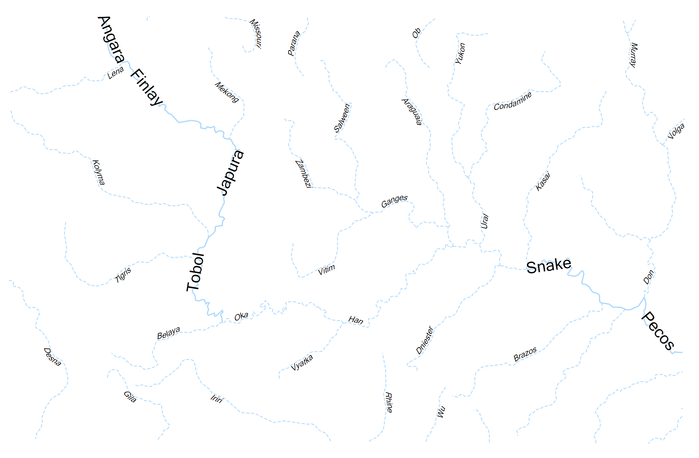

## **Simple Labeling**
The Simple Labeling specifies how features must be labeled.

Supported options are:

|**Property**|**Description**|
| :- | :- |
|[LabelAttribute](https://apireference.aspose.com/net/gis/aspose.gis.rendering.labelings/simplelabeling/properties/labelattribute)|Specifies attribute name to be used as a source of labels.|
|[LabelExpression](https://apireference.aspose.com/net/gis/aspose.gis.rendering.labelings/simplelabeling/properties/labelexpression)|Provides a way to customize and format label text. Overrides LabelAttribute|
|[FontFamily](https://apireference.aspose.com/net/gis/aspose.gis.rendering.labelings/simplelabeling/properties/fontfamily)|Specifies font family to use to render text. The default is system dependent value.|
|[FontStyle](https://apireference.aspose.com/net/gis/aspose.gis.rendering.labelings/simplelabeling/properties/fontstyle)|
Style to apply to text.

- FontStyle.Regular - regular text.

- FontStyle.Bold - bold text.

- FontStyle.Italic - italic text.

- FontStyle.Underine - underlined text.

- FontStyle.StrikeOut - text with a line through the middle.
|
|[FontSize](https://apireference.aspose.com/net/gis/aspose.gis.rendering.labelings/simplelabeling/properties/fontsize)|Specifies size of the text.|
|[FontColor](https://apireference.aspose.com/net/gis/aspose.gis.rendering.labelings/simplelabeling/properties/fontcolor)|Determines color of the text.|
|[HaloSize](https://apireference.aspose.com/net/gis/aspose.gis.rendering.labelings/simplelabeling/properties/halosize)|Determines a size of the halo (or outline) around the text.|
|[HaloColor](https://apireference.aspose.com/net/gis/aspose.gis.rendering.labelings/simplelabeling/properties/halocolor)|Determines color of the halo around the text.|
|[GeometryExpression](https://apireference.aspose.com/net/gis/aspose.gis.rendering.labelings/simplelabeling/properties/geometryexpression)|Geometry expression to be used to transform geometries before passing it to the labeling engine.|
|[MultipartMode](https://apireference.aspose.com/net/gis/aspose.gis.rendering.labelings/simplelabeling/properties/multipartmode)|
Specifies rendering behavior for multipart geometries.

- MultipartMode.All - place a label near every part of the geometry.

- MultipartMode.Any - place one label near any part of the geometry.

- MultipartMode.Largest - place a label near the largest part of the geometry.
|
|[Placement](https://apireference.aspose.com/net/gis/aspose.gis.rendering.labelings/simplelabeling/properties/placement)|
Specifies how labels are placed relatively to the geometry.

- PointLabelPlacement - places label near the center of the geometry.

- LineLabelPlacement - places label along the geometry or its perimeter.
|
|[Priority](https://apireference.aspose.com/net/gis/aspose.gis.rendering.labelings/simplelabeling/properties/priority)|Specifies priority of the label in case if it overlaps with other label. The label with lower priority is not rendered. Default is 1000.|
## **Examples**
### **Points Labeling Examples**
By default SimpleLabeling draws text over points:

|||
| :- | :- |

-----
Here's how to style font:

|||
| :- | :- |

-----
In order to control text position relatively to point feature, placement property must be set:

|||
| :- | :- |

-----
For more advanced scenarios, you might want to choose different labelings for features. Here's how to do that:

|||
| :- | :- |
-----
### **Lines Labeling Examples**
By default SimpleLabeling draws label near center of the line:

|||
| :- | :- |

-----
In order to rotate labels so they are parallel to lines, LineLabelPlacement with LineLabelAlignment.Parallel can be used:

|||
| :- | :- |

-----
If you want texts to follow line precisely, LineLabelPlacement with LineLabelAlignment.Curved can be used:

|||
| :- | :- |

-----
If you don't want texts to overlap with line, use LineLabelPlacement.Offset:

|||
| :- | :- |

-----
For more advanced scenarios, you might want to adjust the labels style dynamically based on feature attribute values. Here's how to do that:

|||
| :- | :- |

