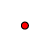
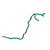

A symbolizer is a way to draw a feature geometry on a map. 

|** |**Symbolizer**|**API Class**|**Description**|
| :- | :- | :- | :- |
||**Marker**|[SimpleMarker](https://apireference.aspose.com/net/gis/aspose.gis.rendering.symbolizers/simplemarker)|Draws a predefined shape with customizable fill and outline. |
||**Line**|[SimpleLine](https://apireference.aspose.com/net/gis/aspose.gis.rendering.symbolizers/simpleline)|Draws a line with customizable styling.|
||**Fill**|[SimpleFill](https://apireference.aspose.com/net/gis/aspose.gis.rendering.symbolizers/simplefill)|Fills a polygon or area bounded by a line with customizable fill and stroke.|
In addition to the symbolizers that do actual drawing, there is a number of other symbolizers that allow combining other symbolizers to create more complex visualizations.

|**Symbolizer**|**API Class**|**Description**|
| :- | :- | :- |
|**Layered Symbolizer**|[LayeredSymbolizer](https://apireference.aspose.com/net/gis/aspose.gis.rendering.symbolizers/layeredsymbolizer)|Draws a feature with several symbolizers on top of each other|
|**Mixed Geometry Symbolizer**|[MixedGeometrySymbolizer](https://apireference.aspose.com/net/gis/aspose.gis.rendering.symbolizers/mixedgeometrysymbolizer)|Draws features from layers that contain geometries of mixed types with a specific symbolizer for each geometry type|
|**Rule-Based Symbolizer**|[RuleBasedSymbolizer](https://apireference.aspose.com/net/gis/aspose.gis.rendering.symbolizers/rulebasedsymbolizer)|Selects a symbolizer to apply to a feature by rules specified by the user.|
|**Geometry Generator Symbolizer**|[GeometryGenerator](https://apireference.aspose.com/net/gis/aspose.gis.rendering.symbolizers/geometrygenerator)|Allow to substitute the feature geometry before rendering.|
|**Null Symbolizer**|[NullVectorSymbolizer](https://apireference.aspose.com/net/gis/aspose.gis.rendering.symbolizers/nullvectorsymbolizer)|Doesn't draw anything. Useful when combined with other symbolizers, such as the rule-based symbolizer.|

