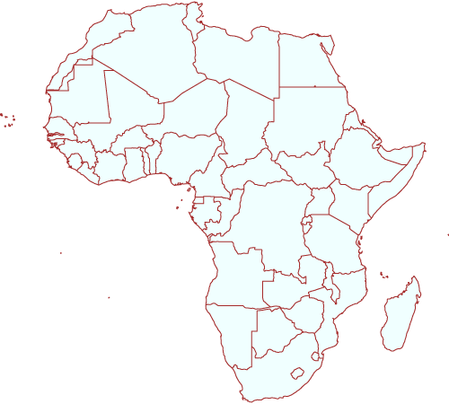

## **Fill Symbolizer**
The Simple Fill symbolizer fills an area with a customizable fill style and stroke. This is the default symbolizer for 2-dimensional geometries (polygons). 

If a polygon has “holes,”  they are not filled, but the borders around the holes are stroked in the usual way. “Islands” within holes are filled and stroked, and so on.

Supported styling options:

|**Property**|**Description**|
| :- | :- |
|[FillColor](https://apireference.aspose.com/net/gis/aspose.gis.rendering.symbolizers/simplefill/properties/fillcolor)|Specifies the color and transparency given to the fill.|
|[FillStyle](https://apireference.aspose.com/net/gis/aspose.gis.rendering.symbolizers/simplefill/properties/fillstyle)|
- Solid - Solid fill

- None - Do not fill the polygon

- Horizontal Hatch - A pattern of horizontal lines.

- Vertical Hatch - A pattern of vertical lines.

- Cross Hatch - Specifies horizontal and vertical lines that cross.

- Forward Diagonal Hatch - A pattern of lines on a diagonal from upper left to lower right.

- Backward Diagonal Hatch - A pattern of lines on a diagonal from upper right to lower left.

- Diagonal Cross Hatch - A pattern of criss-cross diagonal lines.
|
|[StrokeColor](https://apireference.aspose.com/net/gis/aspose.gis.rendering.symbolizers/simplefill/properties/strokecolor)|Specifies the color and transparency given to the stroke line.|
|[StrokeStyle](https://apireference.aspose.com/net/gis/aspose.gis.rendering.symbolizers/simplefill/properties/strokestyle)|Specifies how the symbol linework should be drawn.|
|[StrokeWidth](https://apireference.aspose.com/net/gis/aspose.gis.rendering.symbolizers/simplefill/properties/strokewidth)|Specifies the width of the stroke line.|
|[StrokeDashPattern](https://apireference.aspose.com/net/gis/aspose.gis.rendering.symbolizers/simplefill/properties/strokedashpattern)|Specifies an array of distances that specifies the lengths of alternating dashes and spaces in dashed lines.|
|[StrokeDashOffset](https://apireference.aspose.com/net/gis/aspose.gis.rendering.symbolizers/simplefill/properties/strokedashoffset)|Specifies the distance from the start of a line to the beginning of a dash pattern.|
|[StrokeLineJoin](https://apireference.aspose.com/net/gis/aspose.gis.rendering.symbolizers/simplefill/properties/strokelinejoin)|
Determines how lines are rendered at intersections of line segments.

- Miter - sharp corner

- Round - rounded corner

- Bevel - diagonal corner
|
|[HorizontalOffset](https://apireference.aspose.com/net/gis/aspose.gis.rendering.symbolizers/simplefill/properties/horizontaloffset)|Specifies horizontal offset from a point location  to the shape anchor point.|
|[VerticalOffset](https://apireference.aspose.com/net/gis/aspose.gis.rendering.symbolizers/simplefill/properties/verticaloffset)|Specifies vertical offset from a point location to the shape anchor point.|
#### **Geometry Types**
` `The symbolizer can be applied to geometries of any type.

|**Geometry Dimension**|**Geometry Types**|**Rendering Behavior**|
| :-: | :-: | :-: |
|**Point**|Point, MultiPoint|Draws a small square orthogonal polygon.|
|**Line**|LineString, CircularString, CompoundCurve, LinerRing, MultiCurve, MultiLineString|The line is closed for filling by connecting its end point to its start point. Only the original line is stroked.|
|**Surface**|Polygon, CurvePolygon, MultiPolygon, MultiSurface|Draws the polygon.|

For GeometryCollections, the rendering behavior is determined separately for each geometry inside the collection. Layers with Mixed geometry type follow the logic for GeometryCollections.

Use MixedGeometrySymbolizer to limit a symbolizer to specific geometry types.

### **Examples**
By default the Simple Fill symbolizer a draws black stroke line and solid white fill:

-----
Here's how to change styling:

|||
| :- | :- |

-----
You might also want to add labels to your polygons. Visit [Lines Labeling Examples](/gis/net/simple-labeling-html/#simplelabeling-lineslabelingexamples) for examples on how to label polygons border or [Points Labeling Examples](/gis/net/simple-labeling/#simplelabeling-pointslabelingexamples) on exmaples on how to label polygons centers.
