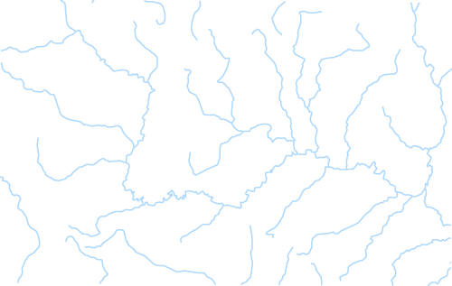
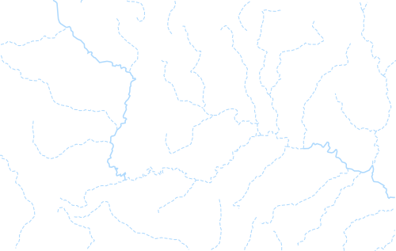

## **Line Symbolizer**
The Simple Line symbolizer draws a line with customizable style. This is the default symbolizer for 1-dimensional geometries (lines). 

Supported styling options:

|**Property**|**Description**|
| :- | :- |
|[Color](https://apireference.aspose.com/net/gis/aspose.gis.rendering.symbolizers/simpleline/properties/color)|Specifies the color and transparency given to the line.|
|[Width](https://apireference.aspose.com/net/gis/aspose.gis.rendering.symbolizers/simpleline/properties/width)|Specifies the width of the line|
|[LineJoin](https://apireference.aspose.com/net/gis/aspose.gis.rendering.symbolizers/simpleline/properties/linejoin)|Determines how lines are rendered at intersections of line segments.|
|[Style](https://apireference.aspose.com/net/gis/aspose.gis.rendering.symbolizers/simpleline/properties/style)|Specifies how the symbol linework should be drawn.|
|[DashPattern](https://apireference.aspose.com/net/gis/aspose.gis.rendering.symbolizers/simpleline/properties/dashpattern)|Specifies an array of distances that specifies the lengths of alternating dashes and spaces in dashed lines.|
|[DashOffset](https://apireference.aspose.com/net/gis/aspose.gis.rendering.symbolizers/simpleline/properties/dashoffset)|Specifies the distance from the start of a line to the beginning of a dash pattern.|
|[CapStyle](https://apireference.aspose.com/net/gis/aspose.gis.rendering.symbolizers/simpleline/properties/capstyle)|
Specifies how lines are rendered at their ends.

- Butt - sharp square edge

- Round - rounded edge

- Square - slightly elongated square edge
|
|[Offset](https://apireference.aspose.com/net/gis/aspose.gis.rendering.symbolizers/simpleline/properties/offset)|Specifies offset from the original line. For positive distance the offset will be at the left side of the input line (relative to the line direction). For a negative distance it'll be at the right side.|
#### **Geometry Types**
` `The symbolizer can be applied to geometries of any type.

|**Geometry Dimension**|**Geometry Types**|**Rendering Behavior**|
| :-: | :-: | :-: |
|**Point**|Point, MultiPoint|Draws a line of a small length with a horizontal orientation centered on the point, with two end caps.|
|**Line**|LineString, CircularString, CompoundCurve, LinerRing, MultiCurve, MultiLineString|Draws the line.|
|**Surface**|Polygon, CurvePolygon, MultiPolygon, MultiSurface|Closed outline of the geometry is used as the line string (with no end caps)|

For GeometryCollections, the rendering behavior is determined separately for each geometry inside the collection. Layers with Mixed geometry type follow the logic for GeometryCollections.

Use MixedGeometrySymbolizer to limit a symbolizer to specific geometry types.

### **Examples**
By default the line symbolizer draws black lines:

-----
Here's how to change line color to blue:

|||
| :- | :- |

-----

For more advanced scenarios, you might want to adjust the line style dynamically based on feature attribute values. Here's how to do that:

|||
| :- | :- |

-----
You might also want to add labels to your lines. Visit [Lines Labeling Examples](/gis/net/simple-labeling-html/#simplelabeling-lineslabelingexamples) for examples.
