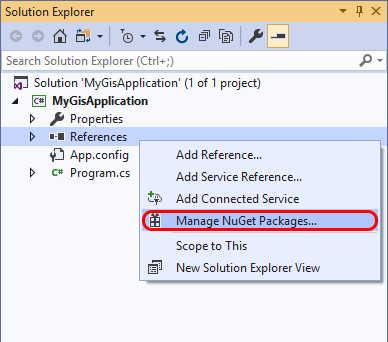
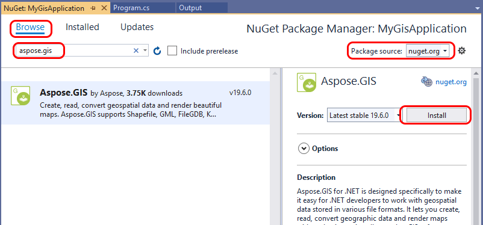
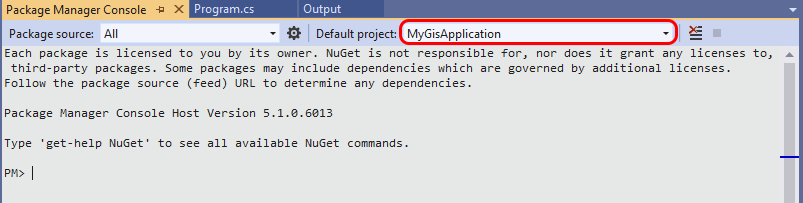

## **Install Aspose.GIS**
### **From NuGet**
To install Aspose.GIS, you use either the Package Manager UI or the Package Manager Console. When you install a package, NuGet records the dependency in either your project file or a packages.config file.
#### **Package Manager UI**
1. In Solution Explorer, right-click **References** and choose **Manage NuGet Packages**.

1. Check that "nuget.org" is selected as the **Package Source**, select the Browse tab, search for Aspose.GIS, select that package in the list, and click Install:

1. Familiarize with [Aspose End User License Agreement](http://www.aspose.com/corporate/purchase/end-user-license-agreement.aspx).
1. If prompted to review changes, select **OK**.
#### **Package Manager Console**
1. Select the **Tools** > **NuGet Package Manager** > **Package Manager Console** menu command.
1. After the console opens, ensure that the **Default project** drop-down list shows the project into which you want to install the package. If you have a single project in the solution, it is already selected.

1. Enter the command Install-Package Aspose.GIS. The console window will show output for the command.
### **With MSI Installer or From ZIP Archive**
As an alternative to NuGet installation, you can download Aspose.GIS from [Downloads section](https://downloads.aspose.com/gis/net) packaged as MSI installer or ZIP archive.
## **Platform-Specific Instructions**
### **Linux**
When using map rendering functionality of Aspose.GIS under Linux, make sure that System.Drawing.Common library is configured correctly. If you get an error message similar to 

"The type initializer for 'Gdip' threw an exception. ---> System.DllNotFoundException: Unable to load shared library 'libdl' or one of its dependencies."

it means that dependencies of System.Drawing.Common are missing from the system. To fix that, run:

apt-get update && apt-get install -y libgdiplus libc6-dev libx11-dev
## **System Requirements for Aspose.GIS for .NET**
All Aspose .NET components require Full Trust permission set.

Aspose.GIS includes two variants of the assembly built for

- .NET Framework 4.7,
- .NET Standard 2.0.

-----
##### **.NET Framework v4.7 or later**
Operating systems: 

- Microsoft Windows 10, 8, 7 SP1
- Microsoft Windows Server 2016, 2012 R2, 2012, 2008 R2 SP1

` `Both 32 and 64 bit versions are supported.
##### **.NET Core v2.0 or later**
` `Operating systems:

- Microsoft Windows 7 SP1, 8.1, 10 Anniversary Update (version 1607) or later versions
- Microsoft Windows Server 2008 R2 SP1 (Full Server or Server Core), 2012 SP1 (Full Server or Server Core), 2012 R2 (Full Server or Server Core), 2016 or later versions (Full Server, Server Core, or Nano Server)
- macOS 10.12 "Sierra" and later versions
- Linux (64-bit, x86_64 or amd64):
  - Red Hat Enterprise Linux 7, 6
  - CentOS 7
  - Oracle Linux 7
  - Fedora 28, 27
  - Debian 9 (64-bit, arm32), 8.7 or later versions
  - Ubuntu 18.04 (64-bit, arm32), 16.04, 14.04
  - Linux Mint 18, 17
  - openSUSE 42.3 or later versions
  - SUSE Enterprise Linux (SLES) 12 Service Pack 2 or later
  - Alpine Linux 3.7 or later versions

More details available in the .NET Core Guide: [Windows Prerequisites](https://docs.microsoft.com/en-us/dotnet/core/windows-prerequisites?tabs=netcore2x), [macOS Prerequisites](https://docs.microsoft.com/en-us/dotnet/core/macos-prerequisites?tabs=netcore2x), [Linux Prerequisites](https://docs.microsoft.com/en-us/dotnet/core/linux-prerequisites?tabs=netcore2x).
##### **Experimental Support**
- Mono 5.4 or later
- Xamarin:
  - Xamarin.iOS: version 10.14  or later
  - Xamarin.Android: version 8.0 or later
  - Xamarin.Mac: version 3.8 or later
