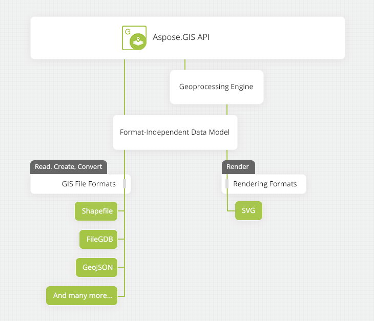

{} 

Aspose.GIS for .NET enables you to access & manipulate geographic information from vector based geo-spatial data formats. You can read, write & convert most popular GIS file formats such as ESRI Shapefile, GeoJSON, KML and GPX files from within your .NET applications without requiring any additional tools or software. It allows you to work with several different geometry types that can further be added as Features to Geo files. 

The API can be used to develop several different types of applications on Windows including ASP.NET, WinForms and Windows Services. It is easy to use, deploy and provides the ideal solution to work with geo-spatial without installing any other software.

{} 
## **Product Description**
Aspose.GIS for .NET allows you to work with GIS data. Besides being simple to use and deploy, it offers benefits of security advantages as a result of 100% managed code. The API's uniform model for working with ShapeFile and GeoJSON lets you work with these file formats without worrying about the internal file structure of these two formats.

The API has the capability to work with a number of geometrical features. It supports basic geometries such as Point, MultiPoint, Line, Multiline, Polygon that can be used to generate complex features as part of supported file formats.

Not only the API supports reading and writing supported file formats, it also offers inter-conversion between these file formats with just a single line of code. This provides the ease of working with these file formats for conversion purposes.

